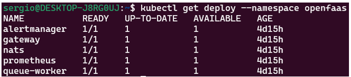
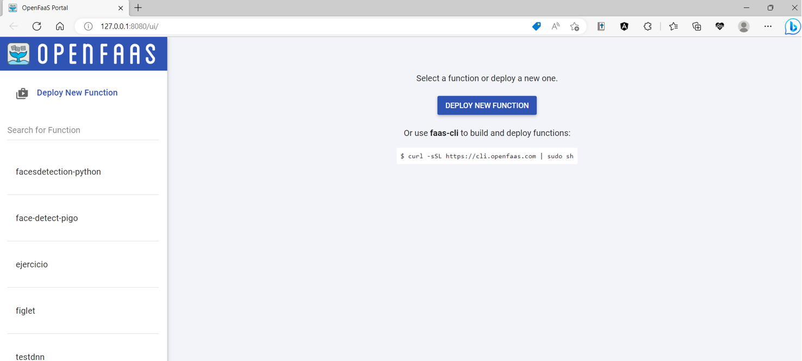

# Práctica 2: Reconocimiento facial con OpenFaaS

## Contenidos

- [Desarrollo y descripción de la configuración de OpenFaaS](#pto1)
    - [Problemas encontrados](#pto11)
- [Implementación de la función de detección facial](#pto2)
- [Pasos para el despliegue de funciones en OpenFaaS](#pto3)
- [Script para desplegar la función en OpenFaaS](#pto4)
- [Conclusiones](#pto5)
- [Referencias](#pto6)

<a name="pto1"></a>
# 1. Desarrollo y descripción de la configuración de OpenFaaS
En primer lugar, se debe destacar que el entorno sobre el que se está llevando a cabo dicha práctica posee Windows 11 22H2 con WSL2 con Ubuntu 22.04 LTS. Además, se necesitan los siguientes requisitos de instalación:
- Instalación de Kubernetes, en este caso, se empelará Minikube.
- Instalación de Arkade y OpenFaaS.

Por un lado, la instalación de Minikube resultó relativamente sencilla aunque tal y como se comentará posteriormente, se encontró un problema principal y fue la ubicación del archivo de configuración de Kubernetes que viene por defecto.

Para ello, se deberá descargar el archivo binario de configuración e instalarlo mediante los siguientes comandos:

```
curl -LO https://storage.googleapis.com/minikube/releases/latest/minikube-linux-amd64
sudo install minikube-linux-amd64 /usr/local/bin/minikube

```
Posteriormente, dado que por defecto Kubernetes establece una ubicación para su archivo de configuración, se debe ejecutar el siguiente comando para que se puede iniciar el clúster de Minikube.

```
unset KUBECONFIG
```

Esta instrucción es utilizada para eliminar la variable de entorno KUBECONFIG del entorno actual la cual es utilizada por las herramientas de línea de comandos de Kubernetes para interactuar con los clústeres de Kubernetes. De esta manera, se elimina la configuración existente para evitar conflictos pero únicamente en el entorno actual donde se ejecuta.
Por último, bastará con ejecutar el siguiente comando para lanzar el clúster:

```
minikube start
```

Por otro lado, para la instalación de Arkade es necesario ejecutar el siguiente comando de instalación:
```
curl -sLS https://get.arkade.dev | sudo sh
```
Una vez instalado Arkade, se podrá instalar OpenFaaS haciendo uso de este a través del siguiente comando:
```
arkade install openfaas
```

Tras finalizar la instalación aparecen una serie de comandos los cuales deben ser ejecutados para poder acceder a la interfaz gráfica de OpenFaaS así como iniciar sesión. Adicionalmente, se puede obtener esta serie de comandos en cualquier momento haciendo uso de la siguiente instrucción, tal y como se puede apreciar en la siguiente imagen:


A continuación describiremos brevemente el significado y funcionalidad de cada uno de ellos:

- El comando `kubectl rollout status` verifica que todos los contenedores en la pila principal de OpenFaaS se hayan iniciado y estén en buen estado.
- El comando `kubectl port-forward` reenvía de forma segura una conexión al servicio Gateway de OpenFaaS dentro del clúster a nuestra máquina en el puerto 8080, el cual permanecerá abierto mientras se ejecute el proceso.
- El comando que posee la variable de entorno PASSWORD se utilizan para obtener la contraseña para poder acceder a la interfaz de usuario de OpenFaaS. En nuestro caso, el usuario y contraseña para poder acceder son los siguientes:
```
username: admin
password: pj8H9NVruO7i
```
- El último comando implementa una función de generador ASCII (`faas-cli store deploy figlet`) y el comando `faas-cli list` permite listar las funciones implementadas en OpenFaaS.

Asimismo, también se pueden visualizar los componentes del _stack_ PLONK implementados, como pueden ser _Prometheus_ y _NATS_:



Tal y como se ha comentado, se puede acceder a la interfaz gráfica de OpenFaaS a través de la dirección URL (http://127.0.0.1:8080/ui/): 



<a name="pto11"></a>
## 1.1.	Problemas encontrados
Tal y como se ha comentado previamente, el principal problema encontrado fue la configuración por defecto de Kubernetes. Sin embargo, dado que en un primer momento no se descubrió esta solución, se optó por instalar de manera “manual” _kubectl_ ya que se presentaban problemas en la instalación de Arkade. Para solucionar estos problemas, se realizaron diferentes soluciones en la propia instalación de Arkade. En la instalación de Arkade, se llevaron a cabo la ejecución de los siguientes comandos:
- `arkade get faas-cli`: Este comando se utiliza para obtener e instalar la herramienta _faas-cli_ utilizando _arkade_.
- `arkade get kubectl`: Este comando se utiliza para obtener e instalar la herramienta _kubectl_ utilizando _arkade_.

A su vez, se siguió la guía oficial de Kubernetes para instalar kubectl y la cual se puede resumir en los siguientes comandos:
```
curl -LO "https://dl.k8s.io/release/$(curl -L -s https://dl.k8s.io/release/stable.txt)/bin/linux/amd64/kubectl"
curl -LO "https://dl.k8s.io/$(curl -L -s https://dl.k8s.io/release/stable.txt)/bin/linux/amd64/kubectl.sha256"
echo "$(cat kubectl.sha256)  kubectl" | sha256sum --check
sudo install -o root -g root -m 0755 kubectl /usr/local/bin kubectl
kubectl version --client

```
<a name="pto2"></a>
# 2. Implementación de la función de detección facial

El lenguaje de programación seleccionado para llevar a cabo el desarrollo de esta función ha sido Python. En ella se han utilizado modelos pre-entrenados que permitan hacer la detección sin tener que crear un modelo desde cero. En este sentido se han realizado diferentes modificaciones de la función proporcionada en el guion de prácticas.
Sin embargo, para poder actualizar la imagen en DockerHub con los últimos cambios, se han añadido nuestro nombre de usuario (en este caso **smy862**) en el nombre de la imagen en el archivo **ejercicio.yml** de la función creada, tal y como se puede observar a continuación:


En nuestro caso ha sido necesario eliminar la configuración de inicio de sesión de Docker puesto que el equipo poseía credenciales incorrectas. Para ello, se ha empleado el comando:

```
rm ~/.docker/config.json
```
Para posteriormente iniciar sesión en DockerHub mediante **docker login.**
Por un lado, el código ha sido adaptado para coger la URL de una imagen como entrada de la función, tal y como se puede observar en el siguiente fragmento de código:


La instrucción `urllib.request.urlopen(inputURL)` realiza una solicitud a la URL especificada en ``inputURL`` (la dirección URL que se le pasa al llamar a la función) utilizando el módulo ``urllib.request``, lo que permite descargar el contenido de la URL y devuelve un objeto de respuesta (``resp``). A su vez, la instrucción ``np.asarray(bytearray(resp.read()), dtype="uint8")`` convierte el array de bytes en un array NumPy, y el parámetro ``dtype="uint8"`` especifica que los elementos del arreglo son enteros sin signo de 8 bits. Por último, la línea ``cv2.imdecode(image, cv2.IMREAD_COLOR)`` decodifica la imagen a partir del array NumPy image, utilizando ``cv2.IMREAD_COLOR`` para cargar la imagen en formato BGR (blue-green-red).
Además, en un primer momento se convirtió la imagen a base64 y así devolver directamente un archivo con el contenido de la imagen:


Atendiendo a la imagen anterior, en la primera línea se codifica la imagen en formato PNG y posteriormente, se hace uso de la biblioteca base4 para codificar en base64 los datos del buffer.
Sin embargo, con el objetivo de simplificar la visualización del resultado final, se ha hecho uso del esquema ``data:image/png;base64``, el cual se utiliza para representar imágenes en formato PNG codificadas en base64. La parte ``data:image/png`` indica que el contenido es una imagen en formato PNG mientras que la parte base64 indica que la imagen está codificada en base64. Cuando se utiliza esta sintaxis, en lugar de proporcionar una URL de imagen tradicional, se puede incrustar directamente la imagen en el código o en un atributo de origen de imagen en HTML utilizando la codificación base64. De esta manera, el código queda modificado de la siguiente manera:


Además, se debe destacar que el archivo requirements.txt posee las siguientes librerías necesarias para el correcto funcionamiento de la función:
```
numpy
opencv-python-headless
Pillow
```
Por otro lado, se ha propuesto llevar a cabo la función de reconocimiento facial a través de una red neuronal convolucional pre-entrenada, también conocida como CNN haciendo uso del módulo ``cv2.dnn``, el cual proporciona la interfaz para trabajar con redes neuronales profundas (deep neural networks, DNN). En este caso, se ha creado otra función llamada “testdnn”, cuyo archivo .yml es idéntico al de la anterior función.


Para ello, en primer lugar se asignan los valores de los archivos del modelo y la configuración a las variables ``prototxt`` (arquitectura de red) y ``weights`` (pesos del modelo) para posteriormente cargar el modelo pre-entrenado mediante la función ``cv2.dnn.readNetFromCaffe``. A continuación, se procede a la lectura de la imagen mediante la URL (tal y como se comentó para la función modificada) y se comienza con el preprocesamiento de la imagen para la detección facial. En esta sección, la imagen se redimensiona a un tamaño de 300x300 píxeles utilizando ``cv2.resize`` y se crea un ``blob`` (objeto de imagen especial) haciendo uso de ``cv2.dnn.blobFromImage``, el cual normaliza los valores de píxeles y realiza otras transformaciones necesarias para la red neuronal.
Más tarde, se pasa el blob de imagen preprocesado a través de la red neuronal utilizando ``model.setInput`` y se obtienen las detecciones utilizando ``model.forward``. Estas detecciones contienen información sobre la ubicación y la confianza de los rostros detectados en la imagen. Seguidamente, se procesan las detecciones recorriendo los resultados donde para cada detección con una confianza mayor que 0.5, se extraen las coordenadas del cuadro delimitador (bounding box) y se agregan alrededor del rostro detectado en la imagen original utilizando ``cv2.rectangle``.
Por último, se convierte la imagen a base64 para poder construir la URL para que el usuario pueda visualizar el resultado final en el navegador. 
Sin embargo, se han obtenido diferentes problemas en la lectura de los archivos de prototxt y weights siendo el principal error obtenido el siguiente: ``cv2.error: OpenCV(4.7.0) /io/opencv/modules/dnn/src/caffe/caffe_io.cpp:1126: error: (-2:Unspecified error) FAILED: fs.is_open(). Can't open "model/res10_300x300_ssd_iter_140000.caffemodel" in function 'ReadProtoFromTextFile'``.

De esta manera, a pesar de que dicho error ha sido problemático por no conseguir determinar con exactitud la ubicación concreta de estos archivos, se ha empleado el siguiente código en la propia función de Python para conocerla:


Tras esto, se ha conseguido ubicar los archivos ``deploy.prototxt`` y ``res10_300x300_ssd_iter_140000.caffemodel`` en la carpeta ``/home/app/function``, por lo que la función ha conseguido ser desplegada con éxito.

<a name="pto3"></a>
# 3. Pasos para el despliegue de funciones en OpenFaaS

En cuanto al despliegue de funciones en OpenFaaS, tal y como se indica en el guion, existen tres mecanismos necesarios para ponerla en marcha tanto inicialmente como para actualizarla. Estos se pueden llevar a cabo mediante los comandos: ``faas-cli build``, ``faas-cli push`` y ``faas-cli deploy``. Sin embargo, mediante el comando faas-cli up se pueden realizar de una manera sencilla. En nuestro caso, para ejecutar la función llamada “ejercicio”, el comando quedaría de la siguiente manera:

```
faas-cli up -f ejercicio.yml
```

_Nota: este comando puede ser ejecutado únicamente cuando se han realizado todos los pasos previos descritos en los apartados anteriores._
Posteriormente, para poder invocar a dicha función a través del comando curl se debe utilizar el siguiente comando:

```
curl -d "https://encrypted-tbn0.gstatic.com/images?q=tbn:ANd9GcSCdio_Sf9aON6NjLHo5fXjG1HNZzWCaTsUjQ" http://127.0.0.1:8080/function/ejercicio -o salida.html
```
Donde la opción **-d** permite especificar una dirección URL la cual se trata de una entrada de datos para indicar la imagen a la que se desea aplicar la función mientras que la opción **-o** se emplea para almacenar la salida en un archivo, en este caso con extensión **.html** para poder visualizar la imagen directamente en el navegador, tal y como se ha indicado anteriormente. Si abrimos el archivo ``output.html`` en el navegador, se puede visualizar la siguiente imagen:


_Nota: se ha empleado la misma imagen de prueba que en los ejemplos del guion de prácticas_.

De manera similar, para la versión mejorada de la función haciendo uso de redes neuronales convolucionales, se debe ejecutar el siguiente comando para poder desplegar y levantar la función:

```
faas-cli up -f testdnn.yml
```

Además, para poder invocar a dicha función a través del comando **curl** se debe utilizar el siguiente comando:

```
Además, para poder invocar a dicha función a través del comando curl se debe utilizar el siguiente comando:
```
Tal y como se puede apreciar en la siguiente imagen, gracias a la red neuronal convolucional, la función de detección facial consigue reconocer un mayor número de rostros:


<a name="pto4"></a>
# 4. Script para desplegar la función en OpenFaaS

Se ha desarrollado un script para el despliegue de las funciones en OpenFaas, el cual sigue la siguiente estructura:

```
#!/bin/bash

minikube start &&
kubectl rollout status -n openfaas deploy/gateway &&
kubectl port-forward -n openfaas svc/gateway 8080:8080 &
sleep 5
faas-cli up -f ejercicio.yml &&
curl -d "https://encrypted-tbn0.gstatic.com/images?q=tbn:ANd9GcSCdio_Sf9aON6NjLHo5fXjG1HNZzWCaTsUjQ" http://127.0.0.1:8080/function/ejercicio -o salida.html &&
faas-cli up -f testdnn.yml &&
curl -d "https://encrypted-tbn0.gstatic.com/images?q=tbn:ANd9GcSCdio_Sf9aON6NjLHo5fXjG1HNZzWCaTsUjQ" http://127.0.0.1:8080/function/testdnn -o testdnn.html
```

En primer lugar, tal y como se ha mencionado en anteriores apartados, es necesario iniciar Minikube y posteriormente ejecutar las instrucciones para realizar el forwarding de OpenFaaS y de esta manera desplegarlo. Posteriormente se hace uso de los comandos para levantar la función y llevar a cabo el _Invoke_ de la misma. Se debe destacar que se ha hecho uso de ``sleep 5`` para que el script espere durante 5 segundos y así dar tiempo al comando anterior (**kubectl port-forward**) para establecer el reenvío de puertos correctamente antes de continuar con los siguientes comandos.

Por consiguiente, basta con ejecutar el comando ``./deploy.sh`` en el directorio de trabajo.

<a name="pto5"></a>
# 5. Conclusiones
El desarrollo de la práctica me ha permitido no solamente conocer y aprender términos y tecnologías nuevas sino también aprender a solucionar problemas atípicos y que requieren de mucha dedicación y paciencia. Sin ir más lejos, durante el desarrollo de la práctica he tenido un problema principal y ha sido el de la ubicación concreta de los archivos de arquitectura de red y pesos en la función de reconocimiento facial que hace uso de redes neuronales convolucionales. Sin embargo, tras realizar infinidad de pruebas conseguí descubrir cuál era el fallo y por consiguiente, especificar la ubicación exacta de dichos archivos.

<a name="pto6"></a>
# 6. Referencias

- [https://kubernetes.io/docs/tasks/tools/install-kubectl-linux/](https://kubernetes.io/docs/tasks/tools/install-kubectl-linux/)
- [https://github.com/vinuvish/Face-detection-with-OpenCV-and-deep-learning/tree/master/models](https://github.com/vinuvish/Face-detection-with-OpenCV-and-deep-learning/tree/master/models)
- [https://omes-va.com/deteccion-facial-dnn-opencv-python/](https://omes-va.com/deteccion-facial-dnn-opencv-python/)
- [https://stackoverflow.com/questions/70118899/cant-open-face-detector-deploy-prototxt-in-function-cvdnnreadprotofromte](https://stackoverflow.com/questions/70118899/cant-open-face-detector-deploy-prototxt-in-function-cvdnnreadprotofromte)
